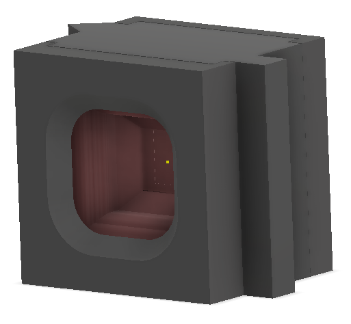
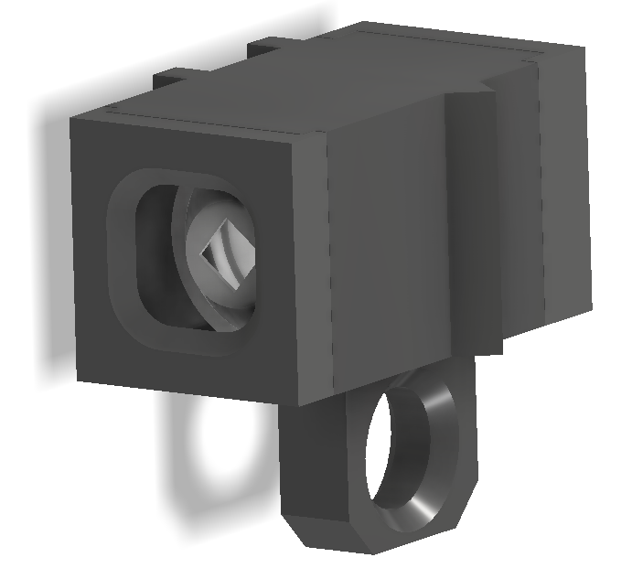
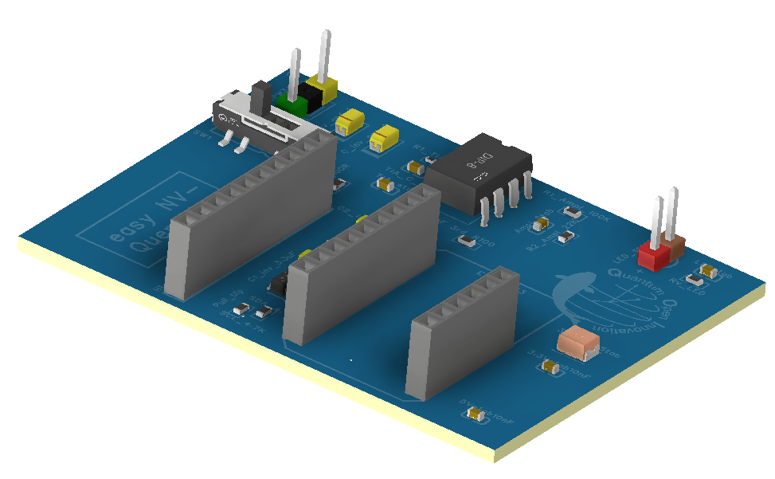

# NV-Center Optical Readout System — Fraunhofer IAO

> Hardware and firmware platform for Nitrogen-Vacancy (NV) center-based optical sensing.
> Acquires photon-count signals from NV-center diamond samples, applies quenching pulses,
> and streams live data via a browser dashboard hosted on an ESP32-S3.


---

## System at a glance

<p align="left">
  
  
</p>

<!-- PLACEHOLDER: animated GIF or short demo video link
<p align="center">
  <a href="https://YOUR_VIDEO_LINK">
    
  </a>
</p>
-->

<p align="left">
  
</p>

---

## Module gallery

| NV Module | Optical Module | Quenching PCB |
|:---------:|:--------------:|:-------------:|
|  |  |  |
| Diamond sample holder | BPW34 photodetector | Rev-5 quenching board |

---

## Hardware overview

| Module | Description | Photo |
| ------ | ----------- | ----- |
| **NV Module** | Diamond sample holder with optical coupling | <!-- PLACEHOLDER: `` --> |
| **Optical Module** | BPW34 photodetector with signal conditioning | <!-- PLACEHOLDER: `` --> |
| **Quenching PCB (rev 5)** | Laser/MW pulse driver for spin initialization | <!-- PLACEHOLDER: `` --> |
| **Readout Box** | Enclosure integrating all modules | <!-- PLACEHOLDER: `` --> |
| **ESP32-S3** | Main MCU — ADC readout + Wi-Fi web server | |
| **ADS1015 / ADS1115** | External 12/16-bit ADC for precision readout | |

---

## Schematic

<p align="left">
  
</p>

Full schematic PDF → [`SCH_Schematic4_2026-02-13.pdf`](Ordered%20PCB/SCH_Schematic4_2026-02-13.pdf)

---

## Performance results

| Metric | Value | Conditions |
| ------ | ----- | ---------- |
| ADC noise floor | ___ LSB RMS | ADS1115, PGA ±0.256 V |
| Sampling rate | ___ Hz | Web server mode |
| Signal-to-noise ratio | ___ dB | Laser power: ___ mW |
| Quenching pulse width | ___ µs | |
| Web dashboard latency | ___ ms | LAN, single client |

<p align="left">
  
  <br><em>Figure 1 — Raw vs. optimized ADC readout (ADD CAPTION)</em>
</p>

---

## Assembly walkthrough

<!-- PLACEHOLDER: step-by-step grid — images already exist in Design Photos/
| Step 1 | Step 2 | Step 3 | Step 4 |
|:------:|:------:|:------:|:------:|
|  |  |  |  |
| Step 5 | Step 6 | Step 7 | Step 8 |
|  |  |  |  |
-->

---

## Web dashboard

<p align="left">
  
  <br><em>Live ADC readout served from ESP32-S3 over Wi-Fi</em>
</p>

After flashing, the ESP32 hosts a dashboard at the IP shown on the serial monitor:

- Live ADC signal plot
- Start / Stop acquisition
- CSV data export

---

## 3D model

<p align="left">
  
</p>

CAD files: Autodesk Inventor assemblies in `Design/`. Printable STLs in `Design/Print/`.

---

## Project structure

```text
Fraunhofer/
├── Design/                        # Mechanical CAD (Autodesk Inventor)
│   ├── Parts/                     # Component libraries (PCB 3D models, connectors, sensors)
│   ├── Photos/                    # Renders and assembly photos
│   ├── Print/                     # 3D-printable STL exports
│   ├── Assembly_NV_Module.iam     # NV sensor module assembly
│   ├── Assembly_Optical_Module.iam
│   ├── Assembly_Quenching.iam
│   └── Assembly_Box.iam           # Enclosure assembly
│
├── Design Photos/                 # Step-by-step build photos and design plots
│
├── ESP32/                         # Firmware (PlatformIO / Arduino)
│   └── ReadOut/
│       ├── ESP32S3 ReadOut/                       # Base acquisition firmware
│       ├── ESP32S3 ReadOut Web Server/            # Web interface variant
│       ├── ESP32S3 ReadOut Web Server Optimized/  # Production variant
│       └── ESP32S3 Noise Optimization/            # ADC noise experiments
│
└── Ordered PCB/                   # Manufacturing files — PCB revision 5
    ├── Gerber_PCB5_2026-02-13.zip
    ├── BOM_Quenching_kit_PCB5_2026-02-13.xlsx
    ├── PickAndPlace_PCB5_2026-02-13.xlsx
    └── SCH_Schematic4_2026-02-13.pdf
```

---

## Firmware

Built with **PlatformIO** (Arduino framework).

```bash
cd "ESP32/ReadOut/ESP32S3 ReadOut Web Server Optimized"
pio run --target upload
```

---

## PCB manufacturing (rev 5)

| File | Purpose |
| ---- | ------- |
| `Gerber_PCB5_2026-02-13.zip` | Upload to JLCPCB / PCBWay |
| `BOM_Quenching_kit_PCB5_2026-02-13.xlsx` | Bill of materials |
| `PickAndPlace_PCB5_2026-02-13.xlsx` | SMT assembly file |
| `SCH_Schematic4_2026-02-13.pdf` | Full schematic |
| `3D_PCB5.step` | 3D PCB model |

---

## Dependencies

| Tool | Version |
| ---- | ------- |
| Autodesk Inventor | 2024+ |
| PlatformIO | Latest (VS Code extension) |
| EasyEDA | v6.5.51 |
| ESP32 Arduino core | Latest stable |

---

## Authors

Samuel Sanchez Moreno — Fraunhofer IAO (HiWi, 2025–2026)
